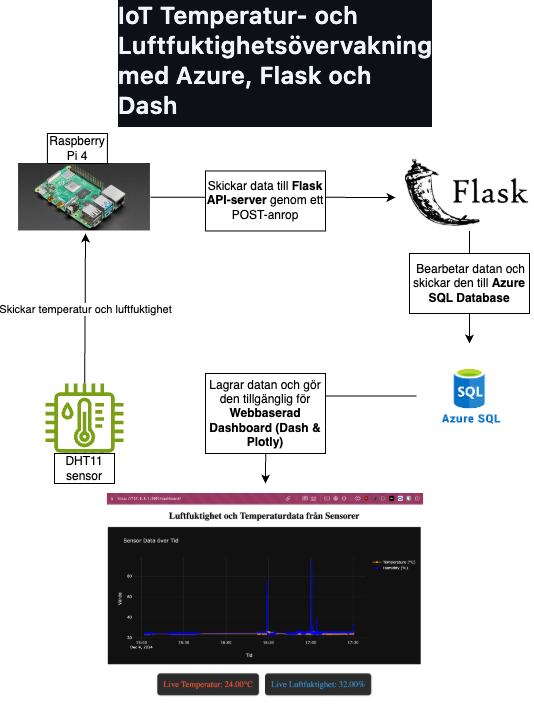
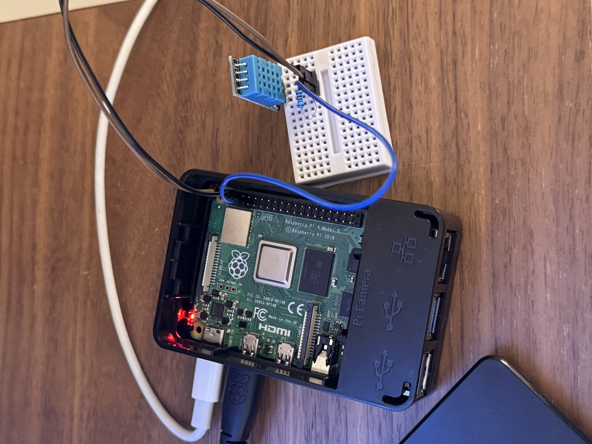
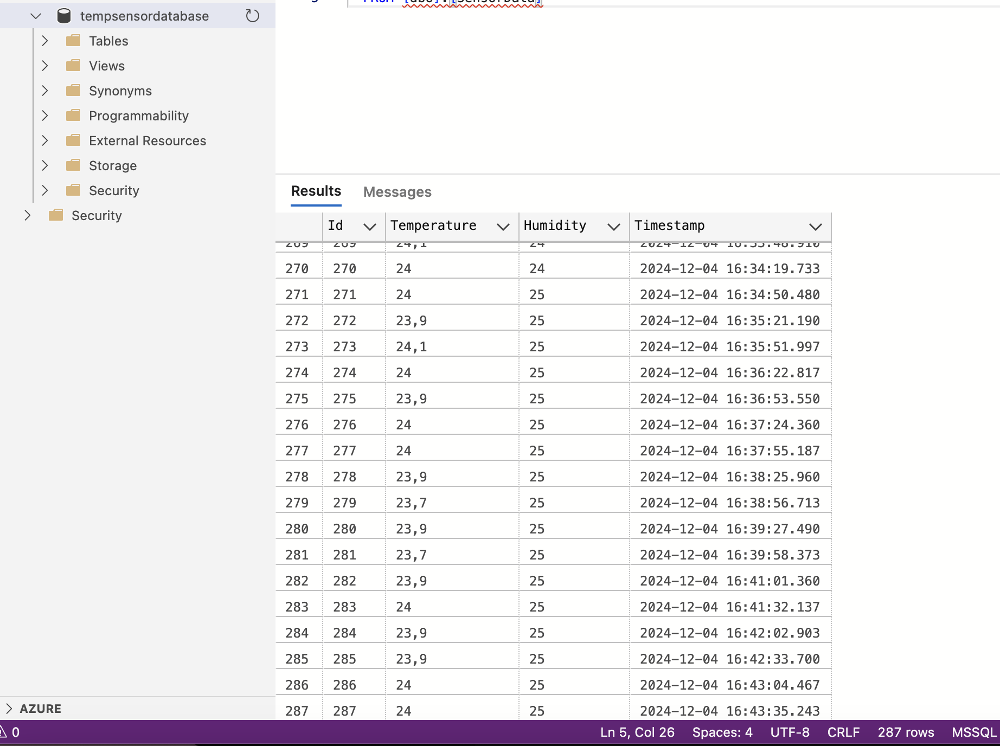
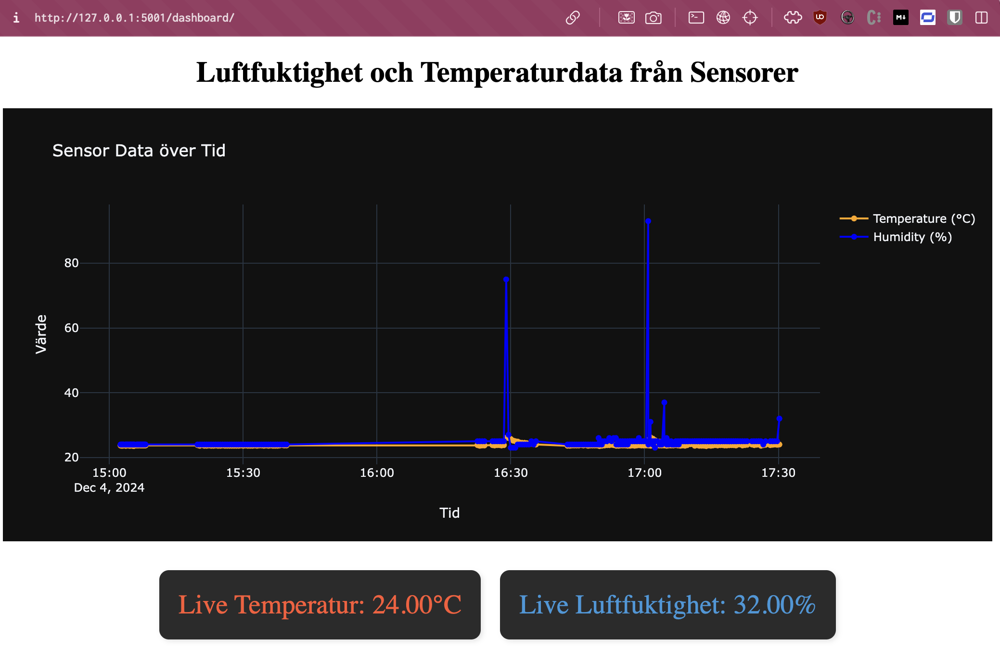
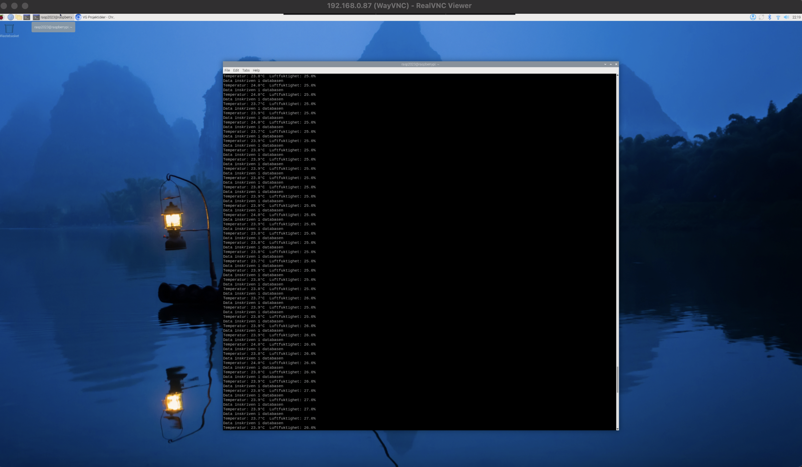

# IoT Temperatur- och Luftfuktighetsövervakning med Azure, Flask och Dash

## Projektbeskrivning

Det här projektet handlar om att skapa en IoT-lösning som övervakar temperatur och luftfuktighet med hjälp av en DHT11-sensor kopplad till en Raspberry Pi. Datan skickas till en Flask-server och lagras i en Azure SQL-databas. Därefter visualiseras datan i realtid via en webbaserad instrumentpanel skapad med Dash och Plotly.

Det här är en komplett IoT-lösning som inkluderar både hårdvaran (Raspberry Pi och DHT11-sensorn) och en molnbaserad lagring samt en visualisering av sensordatan.

## Teknologier som användes
- **Raspberry Pi**: Används för att läsa av temperatur och luftfuktighet från DHT11-sensorn.
- **DHT11-sensor**: En enkel och prisvärd sensor för att mäta temperatur och luftfuktighet.
- **Flask**: Backend-ramverk som sköter API:et för att ta emot sensordatan.
- **Azure SQL**: Molnlagring där sensordatan sparas.
- **Dash och Plotly**: Skapar instrumentpanelen för visualisering av realtidsdata.

## Projektarkitektur
1. **DHT11-sensorn** kopplad till **Raspberry Pi** läser av temperatur och luftfuktighet var 30:e sekund.
2. Datan skickas till en **Flask API-server** som är hostad lokalt.
3. Flask-servern tar emot datan och skickar den till en **Azure SQL-databas** för lagring.
4. **Dash-applikationen** visualiserar datan i en graf och visar de senaste temperatur- och luftfuktighetsvärdena i realtid.

## Diagram över Projektarkitektur
# Här är ett flödesschema som visar hur hela systemet är uppbyggt:



## Hårdvaruuppsättning

För att ansluta DHT11-sensorn till Raspberry Pi behöver du följande komponenter:
- **DHT11-sensor**
- **Raspberry Pi (modell 3 eller senare)**
- **10k ohm resistor**
- **Kopplingskablar**

### Anslutningar:
- **VCC** på DHT11 går till **5V** på Raspberry Pi.
- **DATA**-pinnen är ansluten till **GPIO4** på Raspberry Pi, med en **10k ohm resistor** mellan VCC och DATA-pinnen.
- **GND** kopplas till jord (GND) på Raspberry Pi.

Hårdvara


## Installation och användning

### 1. Raspberry Pi-inställningar
- Anslut DHT11-sensorn till din Raspberry Pi enligt instruktioner.
- Kör skriptet `rasp_api.py` på Raspberry Pi för att läsa av och skicka data.

```bash
python3 rasp_api.py
```

### 2. Flask API-server och Dash-applikation
- Klona detta projekt till din lokala dator.
- Installera nödvändiga bibliotek via `requirements.txt`.

```bash
pip install -r requirements.txt
```

- Konfigurera dina Azure SQL-databasanslutningar i `.env`-filen:
  ```
  AZURE_SQL_SERVER=<ditt_servernamn>
  AZURE_SQL_DATABASE=<din_databas>
  AZURE_SQL_USERNAME=<ditt_användarnamn>
  AZURE_SQL_PASSWORD=<ditt_lösenord>
  FLASK_SECRET_KEY=<din_secret_key>
  ```
- Starta Flask-servern och Dash-applikationen:

```bash
python3 app.py
```

- Öppna webbläsaren och navigera till `http://127.0.0.1:5001/dashboard/` för att se instrumentpanelen.

## Skärmbilder
Nedan är några bilder som visar systemets olika delar:

1. **Azure SQL-databas** där datan sparas:
   

2. **Instrumentpanel** som visar grafer över temperatur och luftfuktighet:
   

3. **Raspberry Pi-terminalen** när den skickar data till API:t:
   

## Schema för databasen
- **Tabellnamn**: `SensorData`
  - **Id**: Primärnyckel (int)
  - **Temperature**: Temperatur i grader Celsius (float)
  - **Humidity**: Luftfuktighet i procent (float)
  - **Timestamp**: Tidsstämpel i UTC (datetime)

## Utvecklingsmiljö
- **Operativsystem**: MAC OS för Flask-servern, Raspbian för Raspberry Pi.
- **Språk**: Python
- **IDE**: VSCode samt nano för Raspberry Pi.
- **Molntjänst**: Microsoft Azure (för SQL-databas)

## Tidsstämplar och hantering av tidszoner
I det här projektet används **Stockholm-tidszon** för att läsa av och visa data, medan datan lagras i **UTC** i databasen. Den här metoden säkerställer att alla datastämplar är konsekventa och kan jämföras oberoende av plats, vilket är viktigt i IoT-projekt där olika enheter kan befinna sig i olika tidszoner.

## Miljövariabler och säkerhet
För att undvika att känslig information (såsom databaskredentialer) hamnar i versionshanteringssystemet, används en `.env`-fil för att lagra anslutningsdetaljer. Se till att `.env`-filen läggs till i `.gitignore` för att skydda ditt projekt.

Exempel på `.env`-fil:
```plaintext
AZURE_SQL_SERVER=<ditt_servernamn>
AZURE_SQL_DATABASE=<din_databas>
AZURE_SQL_USERNAME=<ditt_användarnamn>
AZURE_SQL_PASSWORD=<ditt_lösenord>
FLASK_SECRET_KEY=<din_secret_key>
```

## Funktioner och specifikationer
- **Sensoravläsning var 30:e sekund**: DHT11-sensorn läser kontinuerligt av temperaturen och luftfuktigheten.
- **Flask API för datainsamling**: Flask tar emot POST-förfrågningar från Raspberry Pi.
- **Lagring i Azure SQL**: All data sparas i en molndatabas för att kunna analyseras och visualiseras.
- **Realtidsuppdatering med Dash**: Instrumentpanelen visar senaste sensordatan i realtid med 30 sekunders intervall.

## Framtida utveckling
- **Utöka visualiseringen** genom att lägga till fler sensorer eller använda olika visualiseringstyper i Dash.
- **Deploya Flask-servern** till en publik molnmiljö (exempelvis Azure eller AWS) för att få en publik URL som Raspberry Pi kan skicka data till.